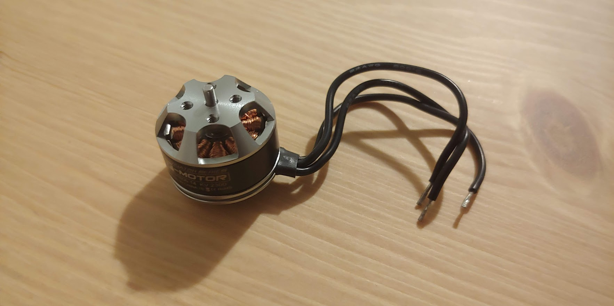
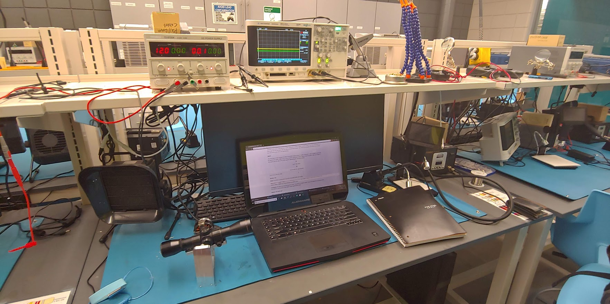

# TeleTracker - CS590 Independent Study

## Index

1. [**Abstract**](#abstract)

2. [**Motivation**](#motivation)

3. [**Design Specification**](#design-specification)

	* [*Hardware*](#hardware)
	* [*Software*](#software)
	
4. [**Test Bench**](#test-bench)

5. [**Experiments**](#experiments)

	* [*AS5048A*](#as5048a)
	* [*BLDC*](#bldc)
	
6. [**References**](#references)

## Abstract

The objective of the independent study is to find a **simple and inexpensive** method of making a telescope tracking mount and studying the software and hardware challenges associated with such an endeavor. The following sections cover the motivations, design aspect, software and experiments associated with the project.

## Motivation

Let say, you wanted to take a picture of the Orion Nebula from your backyard. Even if you get a more that capable telescope for 100-200$, you will still not be able to pull this off because:

1. The earth rotates at a constant rate, making the sky shift.

<p align="center">

</p>
<p align="center">
Fig 1: Earth’s rotation and its effects on sky.
</p>

<p align="center">

</p>
<p align="center">
Fig 2: Trailing of stars due to earth's rotation as observed from my home.
</p>

2. It’s hard to locate a dim object in the night sky accurately and their position changes based on location.

<p align="center">

</p>
<p align="center">
Fig 3: Location and the Sky.
</p>

3. Light pollution makes it difficult to see the stars and take pictures.

<p align="center">

</p>
<p align="center">
Fig 4: Light pollution as observed from my home.
</p>

<p align="center">

</p>
<p align="center">
Fig 5: Same image after software filtering.
</p>

I wanted to address these problems by making my own tracker system which performs the following basic features:

1. Be able to locate objects in the sky.
2. Compensate for any vibrations and shifting of the sky.
3. Take stacked exposure shots of objects with a Raspberry Pi Camera.

## Design Specification

I set some design specifications for the projects based my personal preference and budget limitations. The specifics are discussed below along with why they are appropriate for my application.

### Hardware

The hardware had to inexpensive and easy to procure so others can replicate my results. This would also allow me to make my tracker at a low price point. It is possible to buy trackers with the same capability at 600-1000$ price point, so it makes sense to make sure my tracker cost less than 600$.

#### BLDC Direct Drive

The tracker requires an actuator to move, in this case that will be a motor. One can use a motor in conjunction with a gears, belt or pulley system to make it more cost effective, but I decided not to do this because such systems introduce backlash error and other forms of errors due to machining tolerances. Instead, I choose to do a direct drive, which in simple terms means that I will be mounting the apparatus directly to the motor drive shaft. For this to work the load must be well balanced, in order to not apply any significant torque on the motor.

Furthermore, I must be able to control the position of the motor accurately. One might conclude that the appropriate choice for such an application would be a stepper motor. Unfortunately, stepper motors have a fixed number of steps per revolution which is far coarser than what I needed for my application.

Although, the stepper motor wouldn't be appropriate for my applications, its mechanism of controlling position by energizing different phases led me to the motor type that can get me the resolution I need. BLDC motor are like steppers in the sense that they have 3-phases that can be controlled. But unlike stepper motors you can modulated each of the phases to get many fine positions with the motor. They are also relatively inexpensive due to their simple brushless construction and heavy use in RC model aviation. Here is an image of a BLDC motor and its physical and electrical construction.

<p align="center">

<p align="center">
Fig 6: BLDC Motor.
</p>

<p align="center">

<p align="center">
Fig 7: Physical and electrical construction of a BLDC motor.
</p>

Despite BLDC motor's simple construction their drive mechanism is rather complicated. The require three 120 deg phase shifted sinusoidal signals on the phases to rotate. The later sections discuss how I plan on achieving this. The ability to do this process (referred to as commutation) is the making and breaking point of this project.

<p align="center">

</p>
<p align="center">
Fig 8: BLDC drive analog and digital commutation.
</p>

Digital Commutation Table:

Step|Phase A|Phase B|Phase C
:-:|:-:|:-:|:-:
1|1|0|1
2|0|0|1
3|0|1|1
4|0|1|0
5|1|1|0
6|1|0|0

#### Absolute Rotary Encoder

Although I can commutate the motor using simple senseless techniques described in many [research papers](https://scholar.google.com/scholar?hl=en&as_sdt=0%2C15&q=bldc+sensorless+control&oq=BLDC+Sens), it is difficult to do so accurately in an open control scheme. To deal with this I paired the motor with an absolute rotary encoder that can be used for closed loop control. I decided to go with AS5048A, which is a 14-bit hall-effect absolute rotary encoder. It uses a small magnet to get its absolute rotary position. The reason I went with this kind of an encoder is simple, it was the cheapest one I could find that had the resolution that I needed.

<p align="center">

</p>
<p align="center">
Fig 9: AS5048A evaluation board.
</p>

This sensor works on an interesting principle which I will talk about briefly. It uses hall-effect which can be visualized as the shifting of flowing electrons due to a magnetic field. This shift can be detected as a potential difference. If you have multiple hall-effect elements, then you can map the relative magnitudes of the voltage to magnitude of magnetic flux density and translate that to a vector. That gives you the absolute rotary position. Thankfully, all of this is handled internally by the IC and it gives us an absolute position through and SPI interface.

<p align="center">

</p>
<p align="center">
Fig 10: Hall-effect illustration.
</p>

Notes on the SPI Interface Registers

|Register Address|Register Purpose|Notes|Type|
|:-:|:-:|:-:|:-:|
|0x0016|Zero Postion 6-13 bit|Bits 0-7 are used for this.|Read/Write|
|0x0017|Zero Postion 0-5 bit|Bits 0-5 are used for this.|Read/Write|
|0x3FFD|Internal Sensor Signal Gain Value|Bits 0-7 are used for this.|Read|
|0x3FFE|Absolute Postion without Zero Correction|14-bit value.|Read|
|0x3FFF|Absolute Postion with Zero Correction|14-bit value.|Read|

Notes on the SPI Interface Packet

|Packet Scheme|||
|:-:|:-:|:-:|
|15 bit|14 bit|13-0 bits|
|Even Parity Bit|Read/Write Bit|Data/Register Address|

Notes on the SPI Interface Read

|Master|Direction|Slave|Purpose|
|:-:|:-:|:-:|:-:|
|Make Packet|||Construct Packet with Parity and Read Register Address|
|Pull Chip Select High|->||Make Slave Listen|
||<-|Send Data Packet|Slave Responds|
|Get Packet|||Receive the Packet|
|Pull Chip Select Low|->||Make Slave Stop Listening|
|Decode Packet|||Translate the Data Packet to Usable Data|

#### H-Bridge Driver

As discussed above driving a 3 phase BLDC is quite complicated. This results in the driving hardware being substantially expensive compared to other types of motors. BLDCs in the market are generally designed for high rpm application and consequently the drivers for low RPM applications are expensive. I looked at a couple of options like ICs from a company called Trinamic Motion Control. All these ICs integrate several features like back EMF sensing, current sensing, break before make etc.; to have more accurate control of the motor. As much as I would have liked to have such features on my final project, it isn't exactly inexpensive. So, I decided to go with the simplest driver possible. Here is the simplified version of the driver I am using.

<p align="center">

</p>
<p align="center">
Fig 11: Electrical representation of TI DRV8313.
</p>

Ideal this would require three half H-Bridges which are like switches for each coil. Unfortunately, I only had access to a dual full H-Bridge, the L298N driver chip. This allowed me to drive up to 4 phases using the driver board. It has some good and bad attributes. One of the good attributes is the fact that it has ability to drive high currents up to 1.5 A per H-Bridge. The downside is that it has limited current sensing capabilities, which I do plan on using to make my control algorithm more effective.

<p align="center">

</p>
<p align="center">
Fig 12: Electrical representation of L298N.
</p>

#### Feather M0 for RT Procs

The Feather M0 is an Atmel SAMD21 development board which has an ARM Cortex M0. I am using it in conjunction with Arduino bootloader. This has made quick prototyping quite easy and the chip is more than capable of handling the control loop. It also has the advantage of having a higher clock speed as well as the ability to do higher frequency PWM. I can also speed up my code by modifying the timer registers directly. Later, I describe how that works. Since the chip doesn't have any underlying multi-tasking operating system, we must rely on interrupts for time delays and servicing data sent by the Raspberry Pi.

<p align="center">

</p>
<p align="center">
Fig 13: Feather M0.
</p>

PWM is Pulse Width Modulation. In a nutshell, it allows us to emulate an analog signal by sending a digital signal with varying width of digital high and low. If we do this rapidly, then the inductor treats the switching signal as similar to an analog average. To make this happen, the SAMD21 has keep tight track of time. It is obvious that one can do this in software (bit-banging) by using the internal clock but that would make it difficult to handle multiple PWM outputs and perform other tasks as well. To facilitate this, the chip has several internal clocks that can be dispatched to perform the task of generating the PWM signal.

#### Raspberry Pi for Image Processing and Yale Bright Star Catalogue

The reason I choose to work with the Raspberry Pi was because it easily accessible and has plenty of support material online. This would make my work easier and make it possible for others to easily replicate my results. OpenCV takes about an hour to install on a Pi, that is running Raspbian OS. I recommend using [this](https://www.pyimagesearch.com/2018/09/26/install-opencv-4-on-your-raspberry-pi/) tutorial. Unfortunately, the image processing cannot be CUDA accelerated as Raspberry Pi doesn't have the necessary hardware. This, however, is not that big of a problem because the image processing, I am attempting to do is not very compute intensive. In fact, one doesn't even need to use OpenCV. Here is a rough algorithm that one can use in any language of their choosing:

|Algorithm|Specifics|
|:--|:--|
|Set camera parameters like ISO, focus, exposure etc.|Most of these must be set based on experimentation. But if one is using this for the night sky, the parameters will stay consistent across multiple nights.|
|Acquire image data from the camera.|The Pi Camera acts as a DMA device with the help of the Pi GPU. This means acquiring frames are quite easy.|
|Aggregate RGB into a brightness map.|This can be done easily with array manipulation and is a good candidate for concurrency.|
|Locate the brightest spot on the map.|This can be done by searching for the largest brightness value. I am considering two different approaches to perform this concurrently. In one case each line of data can be assigned to a thread and the max value storage can be protected from data corruption with the help of locks. In another scenario, we don't even need locks. We just find the brightest point in each line concurrently and then find the brightest point in those bright points.|
|Compute delta.| Find out the position of the brightest spot in relation to the center. This will require some filtering. Maybe a Kalman filter. Maybe apply kernel convolution in the RGB to grayscale step.|

Apart from using image processing for stabilization. We first need to get the object in frame. Despite there being heavy collaboration between astronomers around the world, I couldn't find a consolidated database for all stellar/celestial objects. I was able to find files from [universities](http://tdc-www.harvard.edu/catalogs/bsc5.html) that stored multiple objects. We can use this in relationship with the GPS, time and orientation to compute the location of objects in the sky. Moreover, advance simulation environments like [Stellarium](http://stellarium.org/) can also compensated for motions of different objects in the sky.

<p align="center">

</p>
<p align="center">
Fig 14: Raspberry Pi.
</p>

One thing that I am still considering is running the real-time portion of the code on the Raspberry Pi. There are some provisions within Linux that claim to provide real-time like performance. [LinuxCNC](http://linuxcnc.org/) was a reference that seem to indicate that this is possible. There is also the option of using a real-time OS like [ChibiOS](http://www.chibios.org/dokuwiki/doku.php) and the trouble of porting all the necessary features to a real-time OS.

#### Pi Camera NoIR

Pi Camera was an obvious choice because I am using a Raspberry Pi. The NoIR variant was a choice I made based on my application. To understand this, we need talk a little bit about how digital cameras work. The have a CCD or a Charge Coupled Device which is an array of small light sensors that capture levels of RGB in a scene. But one downside is that they are sensitive to IR light which throws of the color of the produced image. To fix this a camera often has an IR filter which blocks out IR light. This is useful for standard cameras but is less optimal for astro-photography. You want your sensor to get as much light as possible to reduce ISO and get less noisy images. You can also reduce exposure time which can improve sharpness as vibrations in the system don't easily turn into artifacts in the image. Thus, I went with the NoIR variant. The focus must be manually adjusted for the Pi Camera. But this is a good thing as we can adjust it once and not have to worry about it later.

<p align="center">

</p>
<p align="center">
Fig 15: Pi Camera NoIR.
</p>

The camera also works with the GPU to have frames available to the CPU using Direct Memory Access (DMA). This can simplify the process of image acquisition and is illustrated [here](https://picamera.readthedocs.io/en/release-1.13/fov.html). Here are some pictures to illustrate effects of ISO, IR, and Exposure.

<p align="center">

</p>
<p align="center">
Fig 16: Dark image due to low ISO.
</p>

<p align="center">

</p>
<p align="center">
Fig 17: Noisy image due to high ISO.
</p>

<p align="center">

</p>
<p align="center">
Fig 18: Dark image due to low exposure.
</p>

<p align="center">

</p>
<p align="center">
Fig 19: Blurry image due to high exposure.
</p>

<p align="center">

</p>
<p align="center">
Fig 20: Effects of IR on image.
</p>

### Software

The software is limited by the hardware available. But I have tried to keep it simple so it can be more readily used or ported to other hardware.

#### PWM approximation of Sine Wave

In the hardware section I talked about how the BLDC motor requires 3 phase 120 deg offset sine wave to control its rotor position. However, it is cost prohibitive to have the hardware produce a sine wave using a Digital to Analog Convertor (DAC). To work around this problem, we can approximate a sine wave's analog levels with a Pulse Width Modulated (PWM) signal.

<p align="center">

</p>
<p align="center">
Fig 21: 25% duty cycle in PWM.
</p>

In my initial experimentation there were two PWM limiting factors; the frequency and resolution. The frequency is the number of frames the hardware can produce in a second. This was causing audible noise in the coils that is a function of the PWM frequency and to get rid of it I would have to push the frequency into the in-audible range of audio frequencies. The resolution is the number of individual pulse width sizes available in each frame. This would influence the theoretical resolution of the motor position. I would have to increase this enough to not run into resolution problems. To achieve this one must set parameters for a timer in the SAMD21 and the process is illustrated [here](https://cdn.sparkfun.com/datasheets/Dev/Arduino/Boards/Atmel-42181-SAM-D21_Datasheet.pdf) in Section 30 on page 651.

<p align="center">

</p>
<p align="center">
Fig 22: Single slope PWM in SAMD21.
</p>

Sine approximation can be done using a look-up table that stores the PWM values for a sine wave. I found this [calculator](http://elabz.com/wp-content/uploads/2011/11/sin_funct.zip) online that provided the values which can then be used to drive the motor. It might still be possible to drive the motor using a truer sine waves using audio hardware which is relatively in-expensive.

#### Kalman Filter

The Kalman filter is intended to zero in on the true value of the sensor by taking multiple observations. It is relatively simple to implement for a single sensor and you can find multiple libraries that have the filter already implemented. The basic idea is that previous observation and approximation is used to evaluate the trueness of the current observation to derive a new approximation. I found the idea similar to the old RTT estimation method in TCP.

#### 10 arc-min Resolution with Encoder

This resolution will be attained by using a database to obtain absolute position of the object in the sky. Then computing the relative position of the telescope to that object. The resultant data can be fed into the targets of the PIDs that controls the BLDCs and gets feedback from the encoders.

#### Zero Torque Problem

As the BLDC reaches the intended position. The torque on the motor nears zero, which means it can't hold that position. This is a problem as we want to keep the system steady at that position. To get around this problem we can oscillate the target position at a high frequency around the intended position so that the rotor has a holding torque. This however seems to be overcomplicated solution to a simple problem. If we for-go the sine approximation and just switch between the 6 orientations achievable by a digital signal in the motor. We can have a simpler solution to the zero-torque problem.

The solution involves rapidly switching between two positions to maintain a torque in the middle of said positions. One can also alter the rate of the position switching to fix the rotor in orientations between the two positions. Here is an illustration of how that would work in principle using PWM.

#### 1 arc-min Resolution with Image Processing

Once the object is in the field of view, we switch from the encoder to the image processing algorithm to control the motor using PID.

## Test Bench

To test my hardware and software choices, I decided to make a single axis setup for a small scope. This would allow me to run more tests without requiring a complicated and/or expensive hardware setup. I made my setup using aluminum, most because it was freely available and was homogenous. In a control system the hardware needs to be rigid to avoid sloppiness. Also, we must be aware of the resonance frequency of the system to avoid inducing excessive vibrations. Using aluminum address both concerns. Here are the designs:

<p align="center">


</p>
<p align="center">
Fig 23: Test bench which was fabricated out of aluminum. Click link below for full file.
</p>

[CAD1](https://a360.co/2N6Xfia)
[CAD2](https://a360.co/2YsIRpC)

<p align="center">

</p>
<p align="center">
Fig 24: Test bench after fabrication.
</p>

## Experiments

I have run some experiments evaluating the theoretical principle that I have been studying. They are meant to help guide the design and future iteration of the project. With each iteration, I have stated the setup, observations and conclusions.

### AS5048A

The rotary encoder was evaluated on a HAAS ST20Y to check its linearity and to attempt to minimize noise using physical and in software method. Below I have attached the mount files and image of the setup.

<p align="center">

</p>
<p align="center">
Fig 25: Mount for precision alignment.
</p>

[CAD3](https://a360.co/2YuPI27)

<p align="center">

</p>
<p align="center">
Fig 26: Mount after fabrication.
</p>

<p align="center">

</p>
<p align="center">
Fig 27: Mount in testing equipment.
</p>

Header

```c
/* Macro Vars */
#define SPI_CS      10
#define SER_BAUD    9600
#define SENS_READ   0x4000
#define SENS_WRITE  0x0
#define UNIT        0x1
#define BIT_STRIP   0x3FFF
#define ANG_REG     0x3FFF
#define CIRC_DEG    360.0
#define CIRC_INT    16384.0
#define COR_REG     0x3FFE
#define DAG_REG     0x3FFD
#define ZRH_REG     0x0016
#define ZRL_REG     0x0017
#define AMP_STRIP   0xFF
#define ZRH_STRIP   0xFF
#define ZRL_STRIP   0x3F
#define ZR_MOD      0x3FFF
#define ERR_MEA     0.02197

/* Global Vars */
SPISettings spiBaud = SPISettings(1000000, MSBFIRST, SPI_MODE1);
uint16_t zero = 0;
uint16_t samples = 10;
float errEst = 0.03;
float est = 45.0;
float k = 0;

/* Helper Funcs */
uint16_t readReg(uint16_t);
uint16_t writeReg(uint16_t, uint16_t);
float getAngle();
uint16_t getRawAngle();
uint16_t getCordic();
uint16_t getGain();
uint16_t getRawZeroPos();
void setZeroPos();
uint8_t parityCalc(uint16_t);
uint16_t breakPacket(uint16_t);
uint16_t makePacket(uint16_t, uint16_t);
uint16_t sendPacket(uint16_t);
float getKalmanAngle();
```

Source

```c
/* Import Libs */
#include <Arduino.h>      // Arduino Core
#include <SPI.h>          // SPI Library
#include <angleSensor.h>  // Header

/* Setup */
void setup() {
  // Set as OUTPUT
  pinMode(SPI_CS, OUTPUT);
  // Disable Chip
  digitalWrite(SPI_CS, HIGH);

  // Begin SPI Comms
  SPI.begin();

  // Begin Serial Comms
  Serial.begin(SER_BAUD);

  // Zero Sensor
  setZeroPos();

  // Wait Hello
  while(!Serial);
  Serial.println("Data Start");
}

/* Loop */
void loop() {
  while (Serial.available() <= 0);
  String num = "";
  num += (char)Serial.read();
  num += (char)Serial.read();
  num += (char)Serial.read();
  int j = num.toInt();
  int i;
  if(j != 0) {
  for(i = 0; i < 200; i++) {
    Serial.print(i);
    Serial.print(',');
    Serial.print(getAngle());
    Serial.print(',');
    Serial.print(k);
    Serial.print(',');
    Serial.print(errEst);
    Serial.print(',');
    Serial.println(getKalmanAngle());
    delay(20);
  }}
  //Serial.println(getKalmanAngle());
}

/* Abstract Funs */
float getAngle() {
  //uint16_t angleRaw = getRawAngle();
  //int angleCor = (int)angleRaw - (int)zero;
	//if(angleCor > 8191) angleCor = -((0x3FFF)-angleCor);
  //if(angleCor < -0x1FFF) angleCor = angleCor+0x3FFF;
  return (getRawAngle() / CIRC_INT) * CIRC_DEG;
}

float getKalmanAngle() {
  //uint16_t angleRaw = getRawAngle();
  //int angleCor = (int)angleRaw - (int)zero;
	//if(angleCor > 8191) angleCor = -((0x3FFF)-angleCor);
  //if(angleCor < -0x1FFF) angleCor = angleCor+0x3FFF;
  float meaAngle = (getRawAngle() / CIRC_INT) * CIRC_DEG;

  // Step 1
  float kalmanGain = errEst / (errEst + ERR_MEA);
  k = kalmanGain;

  // Step 3
  errEst = (1.0 - kalmanGain) * est;

  // Step 2
  est = est + (kalmanGain * (meaAngle - est));

  // Step 4
  return est;
}

uint16_t getRawAngle() {
  return readReg(ANG_REG);
}

uint16_t getCordic() {
  return readReg(COR_REG);
}

uint16_t getGain() {
  return readReg(DAG_REG) & AMP_STRIP;
}

uint16_t getRawZeroPos() {
  /**
  uint16_t msb = readReg(ZRH_REG) & ZRH_STRIP;
  uint16_t lsb = readReg(ZRL_REG) & ZRL_STRIP;
  return (lsb << 8) | msb;
  **/
  return zero;
}

void setZeroPos() {
  /**
  uint16_t curAngle = getCordic();
  uint16_t msb = curAngle & ZRH_STRIP;
  uint16_t lsb = curAngle >> 8;
  writeReg(ZRL_REG, lsb);
  return writeReg(ZRH_REG, msb);
  **/
  zero = getRawAngle();
}

/* Helper Funcs */
uint16_t readReg(uint16_t reg) {
  // Return
  return breakPacket(sendPacket(makePacket(reg, SENS_READ)));
}

uint16_t writeReg(uint16_t reg, uint16_t data) {
  // Write Command
  sendPacket(makePacket(reg, SENS_WRITE));

  // Return
  return breakPacket(sendPacket(makePacket(data, SENS_READ)));
}

uint16_t breakPacket(uint16_t pack) {
  return pack & BIT_STRIP;
}

uint16_t sendPacket(uint16_t pack) {
  // Start SPI with Settings
  SPI.beginTransaction(spiBaud);

  // Chip Select Device
  digitalWrite(SPI_CS, LOW);

  // Transfer Command
  uint16_t res = SPI.transfer16(pack);

  // Chip Unselect Device
  digitalWrite(SPI_CS,HIGH);

  // End SPI
  SPI.endTransaction();

  // Return Response
  return res;
}

uint16_t makePacket(uint16_t reg, uint16_t wr) {
  // Append Register Address
  wr = wr | reg;

  // Add Parity
  wr |= (uint16_t)parityCalc(wr) << 15;

  // Return Packet
  return wr;
}

uint8_t parityCalc(uint16_t data) {
  byte cnt = 0;
	byte i;

	for (i = 0; i < 16; i++)
	{
		if (data & 0x1)
		{
			cnt++;
		}
		data >>= 1;
	}
	return cnt & 0x1;
}
```

#### Steady State

**Setup:** I attempt to measure a preset angle of 45 degrees without using any filters and polling the sensor as fast as possible.

**Observations:** I noticed a slight amount of deviation and noise in the signal. The signal jumps between 45.23 and 45.03 with an r-factor of 0.0021 degrees. There was no predictable pattern and the noise was random.

<p align="center">

</p>
<p align="center">
Fig 28: Line graph.
</p>

**Conclusions:** The noise can be due to many factors, but it is expected because of the internal gain circuitry of the IC. I tried to reduce this gain by adjusting the position of the magnet, but the data seems to indicated that the magnets physical and magnetic axis are different in angle and alignment.

#### Steady State with Kalman

**Setup:** I attempt to measure a preset angle of 45 degrees while using a Kalman filter and polling the sensor as fast as possible.

**Observations:** I noticed a slight amount of deviation and noise in the signal. The signal jumps between 45.12 and 44.85 with an r-factor of 0.0009 degrees. There was no predictable pattern and the noise was random. The data did indicate immediate convergence from initial estimate in the filter.

<p align="center">

</p>
<p align="center">
Fig 29: Line graph.
</p>

**Conclusions:** Since, I was unaware of the convergence level of the filter. I am unable to conclude if this filter was actually benefiting the sensor reading. I did observe a lower amount of error, but that is not conclusive proof of the filter working.  

#### Linear Change with Kalman

**Setup:** I attempt to observe the linearity of the sensor from 0 degrees to 100 degrees.

**Observations:** The data shows some periodic deviation from the mean and is accurate up to 1.0 degree.

<p align="center">

</p>
<p align="center">
Fig 30: Line graph.
</p>

**Conclusions:** The amount of error is not acceptable for my application which means I have to either try to make most of the resolution of the sensor using filtering or further calibration or obtain a higher resolution sensor. One cheap alternative is to have a belt drive for the sensor and use it like an incremental encoder. This should be acceptable and should not introduce too much error as the drive is not load bearing.

### BLDC

The next round of tests evaluate the ability of the BLDC to hold and go to a given orientation. I used an Agilent oscilloscope to measure the signals, L298N driver to drive the BLDC and a bench power supply to feed the system. Here is an image of the system and the video of the PWM signal for generating the controlled rotation.

<p align="center">

</p>
<p align="center">
Fig 31: Test setup.
</p>  

<p align="center">

</p>
<p align="center">
Fig 32: PWM sine approximation.
</p>

Click [here](https://www.youtube.com/watch?v=edGPWJ-mFYk&feature=share) to view the video.

#### Rotation Test

**Setup:** Small BLDC running code to perform sinusoidal PWM commutation.

**Observations:** The motor rotates in a controlled fashion but not at a fixed speed. It seems to have certain portions of the rotation where it speeds up. It also produces an audible noise.

<p align="center">

</p>
<p align="center">
Fig 33: Rotation unloaded.
</p>

Click [here](https://www.youtube.com/watch?v=Em4e8ZN3ZCw&feature=share) to view the video.

**Conclusions:** We have previously discussed this noise. The pattern of rotation speed is due to the algorithm not being current controlled as certain positions have higher torque applied than others.

#### Rotation Test with Load

**Setup:** Large BLDC running code to perform sinusoidal PWM commutation.

**Observations:** Similar behavior to previous tests. Although a higher current draw.

<p align="center">

</p>
<p align="center">
Fig 34: Rotation loaded.
</p>

Click [here](https://www.youtube.com/watch?v=lobNVU6qlLo&feature=share) to view the video.

**Conclusions:** This is due to the stall state the motor is in due to the load. This also means the rotation is slightly delayed in orientation till the torque build up.

## References

Most of the references are hyperlinked within the report in their relevant locations. Here I have included the references that are not mentioned above.

[Sidereal Technology](http://siderealtechnology.com/DirectDriveWorkInProgress.pdf)

[ArduinoDeXXX](https://www.instructables.com/id/DIY-Brushless-Gimbal-with-Arduino/)

[Amazon](https://www.amazon.com/Megapixel-without-filter-Silver-Cameras/dp/B0768CGTZX)
