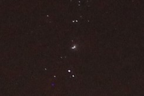

# AR Telescope - CS590 Independent Study

## Abstract

Augmented/Virtual reality lets us explore worlds right from our living rooms. However, these are just virtual constructs. We often forgot the real enviroment around us, and in this case above the us. The night sky is quite fascinating and worth exploring. Unfortunately, the modernization of the world has let to substantial amount of light pollution. If you are in a major city, you would be luck to spot more than a dozen stars. In this independent study, I attempt to explore this often underrated natural environment. I explore everything for constructing a telescope to star-pattern recognition and AR/VR integration. This multidisciplinary approach is enriching as it enabled me to integrate my academic field of computer graphics with my proffesional field of research manufacturing.

## Disclaimer

Right from the start, I wish to clarify that the information I present here is just an account of the work I did. It is by no means complete, optimal or ground-breaking. I ran into several technical challenges, some I was able to overcome, others I am still figuring out how to overcome. The biggest take-away that one can expect from this article is the telescope construction. The designs I came up with our quite a bit more mature than designs presented in other DIY articles. I use more precise industrial manufacturing tecniques and draw a lot of inspiration from the world of research optics. Although I use industrial equipment to manufacture a lot of the parts for the project, the designs are quite adaptable to desktop 3D printing. 

## Star Detection

Before we get into the weeds of actual telescope construction, design and manufacturing; lets acknowledge that when we look up in the sky, most of us can appreicate the beauty of what we are looking at but we are not as good at recognizing stars, celesetial bodies and constelations. Knowing what we are looking at can further enhance our experience and can help us navigate the night-sky. Lets look at an example:

  

    
    

  

  Figure 1: Wide-field shoot of the night sky. Beautiful, but there is more too it.

Here we see a picture of the night-sky. We see a lot of stars, but most of us do not really recognize what we are looking at. We also miss some significant stellar objects that we have managed to capture in the frame as they are drowned out in the sea of point lights. Lets look at a processed image that was obtained by using a software tool called [Astrometry](http://astrometry.net/).

  

    
    

  

  Figure 2: Star detection using astrometry.

That gives us a lot more information about what we are looking at. This means that now we are able to moke more intresting observations. Here is a crop of one of the spots on the previous picture. This might just look like a star, but in reality we have captured a picture of the [Orion nebula](https://en.wikipedia.org/wiki/Orion_Nebula). We are able to make this determination because, with the help of the astrometry overlay, we know exactly where all stellar objects should be in the frame.

  

  Figure 3: Orion nebula.

### Short Tutorial

In this tutorial I outline how to setup the astromtery local on a Windows 10 system. Please not that there is documentation available from astrometry.net, but their documentation is a little outdated compared to their current version of the software. This is a lot more simplified, but if you are interested here is the link to astrometry [documentation](http://astrometry.net/doc/build.html#build).

#### Install Windows Subsystem for Linux

The documentation for this process is can be found [here](https://www.windowscentral.com/install-windows-subsystem-linux-windows-10). Effectively, it adds a headless Ubuntu on your Windows 10 computer. This is important because the build process for Linux is much simpler than for Windows.

#### Update & Upgrade

If you installed the Windows Subsystem for the first time. Please run the following commands on the terminal.

> sudo apt-get update
> sudo apt-get upgrade

#### Install Astrometry

Now we can install astrometry through the package manager. This only install the executables for star detection, it does not have a star dataset to work with.

> sudo apt-get install astrometry.net

#### Get Index Files

Once astrometry is installed, we can now proceed to installing the neccessary datasets for doing star pattern recognition. The terminal commands below are for widefield databases. However, there are more granular databases/index files available from astrometry on this [link](http://data.astrometry.net/debian/).

> wget http://data.astrometry.net/debian/astrometry-data-4208-4219_0.45_all.deb
> sudo dpkg -i astrometry-data-4208-4219_0.45_all.deb

#### Run Solver on Image URL

Now all the neccesary files are installed and we can use the solver on a sample image.

> solve-field [filepath]

Now if you image is located on your Windows File System, please add the following to the path

> solve-field /mnt/[full filepath]

#### Speed Optimization

There are several ways to speed up the star detection process. Here are the two optimization that I have tested and gotten the recognition to happen in seconds. The first you can apply universally to large image files. You can downsample the image by a factor by using this command.

> solve-field --downsample [downsample factor] [filepath]

After you solve the first image, you will know the field of view of your image. It will also tell you the index file that it used to recognize the pattern. I recommend that you only keep index files that are of the same field of view or smaller. The installed index files can be found in the following location:

> cd /usr/share/astrometry/

Use rm to remove index files that you don't need. The nomenclature of the index files are outlined [here](http://astrometry.net/doc/readme.html#getting-index-files).

## Physical Construction

The physical construction that I used is comprised of CNC machined parts made of steel and alluminum. I also use some off-the-shelf parts that are cheaply available. It is also possible to 3D print some of the parts. I provide descriptions of the parts and associated designs, so you can build this telescope for your own use. 

  <iframe src="https://myhub.autodesk360.com/ue28e2e80/shares/public/SH56a43QTfd62c1cd968b35b710071d0253e?mode=embed" width="640" height="480" allowfullscreen="true" webkitallowfullscreen="true" mozallowfullscreen="true"  frameborder="0"></iframe>
 

  Figure 4: CAD model of the telescope.

  

  Figure 5: Telescope on a tripod.

The telescope tube can be sub-divided into three sub-assemblies.

### Back

The back provides the following functionality:
* Retain the primary mirror.
* Allow for collimation of the primary mirror.
* Connect to the middle sub-assembly.
* Heatsink for the primary mirror.

The mirror has to be suspended with minimal obstruction of the reflective surface. This is acheived through toe-clamp style fixturing in the four corners. Obstructions in the path of light will dim the image formed by the mirror and thus they would have to be minimized. It might be tempting to clamp on the mirror from the sides, but the fixturing of the mirror is not meant to be tight, as that can deform the mirror, and a side style clamping approach could result in the mirror falling out. Thus, toe-clamp is the best approach.

The parabolic mirror used has a very precise surface and needs to be positioned accurately in order to function proprerly. Unfortunately, it is very difficult to manufacture a retainment machnaism that can accurately postion the mirror, thus most optical setups include rotational adjustments that can be fine tuned on the final assembly. This was acheived using a system of springs, a fulcrum and positioning screws.

The entire sub-assembly also needs to be linked up to the middle portion and maintain rigidity. I used straight beams because the telescope was small, but for a larger telescope one would need to use cross beams to increase the torsional rigidity of the frame. The metal also acts a passive heatsink for the mirror. The mirror changes it's shape according to its temperature, this means it needs to be collimated while it is at it's operating temperature. The metal helps this by allowing the temperature of the mirror to normalize with ambient temperature quickly.

  <iframe src="https://myhub.autodesk360.com/ue28e2e80/shares/public/SH56a43QTfd62c1cd968ba4ba6a925e52e94?mode=embed" width="640" height="480" allowfullscreen="true" webkitallowfullscreen="true" mozallowfullscreen="true"  frameborder="0"></iframe>
 

  Figure 6: CAD model of the back sub-assembly.

  

  Figure 7: Back sub-assembly.

The key components in this sub-assemlby are:

#### Backplate

It connects to the middle section (colored in red) using reccess and screws. It also houses a pivot socket (colored in green) that a ceramic ball sits on. The weight of the structure is reduced by removing excess material (colored in blue). It also has spring retention sockets (colored in yellow) that provided tension on the pivot mechanism. There are also postioning screw holes (colored in purple) that pivot the mirror.

  <iframe src="https://myhub.autodesk360.com/ue28e2e80/shares/public/SH56a43QTfd62c1cd968816ad51a74a58079?mode=embed" width="640" height="480" allowfullscreen="true" webkitallowfullscreen="true" mozallowfullscreen="true"  frameborder="0"></iframe>

  Figure 8: CAD model of backplate.

  

  Figure 9: Spring retention mechanism.

  

  Figure 10: Connecting rod.

#### Primary Mirror Mount

The primary mirror mount has a recces for the mirror to sit in (colored in red). As well as a pivot socket (colored in green) for the ceramic ball. It also has spring retention sockets (colored in blue) similar to the backplate. There are also toe-clamp holes (colored in yellow) that are used to retain the mirror.

  <iframe src="https://myhub.autodesk360.com/ue28e2e80/shares/public/SH56a43QTfd62c1cd968ce56d999e210499a?mode=embed" width="640" height="480" allowfullscreen="true" webkitallowfullscreen="true" mozallowfullscreen="true"  frameborder="0"></iframe>

  Figure 11: CAD Model of mirror mount.

  

  Figure 12: Pivoting socket with ceramic ball.

  

  Figure 13: Toe-clamps.

### Middle

### Front

## VR/AR Integration

     
     
